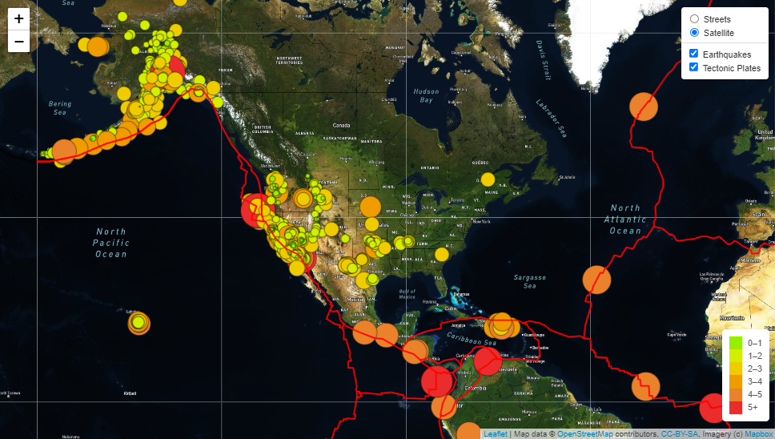
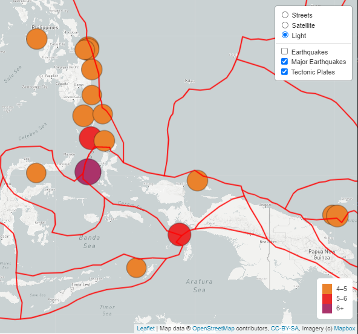

# Mapping_Earthquakes

## Overview

This project is the 13th weekly challenge of the Data Science Bootcamp. It allows us to put into practice and showcase the skills learned in Module 13 of the bootcamp.

### Purpose

Add functionality to the Earthquakes visualisation map developed during the module.

## Results

This project was created in JavaScript using Leaflet.js, and D3. Map layers are sourced from [Mapbox](https://www.mapbox.com/).

All files are located under the folder [Earthquake_Challenge](Earthquake_Challenge/).

Files:
[index.html](Earthquake_Challenge/index.html)
[static/css/style.css](Earthquake_Challenge/static/css/style.css)
[static/js/challenge_logic.js](Earthquake_Challenge/static/js/challenge_logic.js)

Users can now select 1 of 3 map modes (Street, Satellite or Light) and control the display of Earthquakes, Major Earthquakes and Tectonic Plates.

**Note:** An API_KEY value is required for access to Mapbox APIs. It should be added to a file named *config.ps*.  This file is not included in this repository.

### Deliverable 1: Add Tectonic Plate Data

I added the tectonic plate data from the requested json file to the new layer group ```tectonicPlates``` and included the layer on the controls.   The code were the data is added and style is below.

```js
  // 3. Use d3.json to make a call to get our Tectonic Plate geoJSON data.
  let url = "https://raw.githubusercontent.com/fraxen/tectonicplates/master/GeoJSON/PB2002_boundaries.json"
  d3.json(url).then(function(data) {
    //console.log(data)
    L.geoJson(data,{
        color: 'red',
        weight: 2}).addTo(tectonicPlates);
  });
  tectonicPlates.addTo(map);
```



### Deliverable 2: Add Major Earthquake Data

I added a layer for to the overlay for the data containing earthquakes with a magnitude greater than 4.5 from the URL provided. As this layer is redundant when the All Earthquakes layer was being displayed, I made them mutually exclusive. The following piece of code makes sure that only one layer is ON and it switches the corresponding legend on and off.

```js
  //make allEarthquakes and majorEarthquakes mutually exclusive.
  //change the legend on display
  //the setTimeout is needed to keep the 'overlayadd' event from firing multiple times
  map.on('overlayadd', function(eo) {
    if (eo.name === 'Earthquakes') {
      setTimeout(function() {
        map.removeLayer(majorEarthquakes);
        map.removeControl(legendMajor);
        legend.addTo(map);
      }, 10);
    } else if (eo.name === 'Major Earthquakes') {
      setTimeout(function() {
        map.removeLayer(allEarthquakes);
        map.removeControl(legend);
        legendMajor.addTo(map)
      }, 10);
    }
  });   
```

### Deliverable 3: Add an Additional Map

I added a **Light** map layer and included it within the ```baseMap``` controls. See the snapshot below.



## Summary

Leaflet.js and D3 were used to retrieve data from multiple sources and display on a Mapbox generated map layer.

Controls allow users to select base map and overlays to display.
